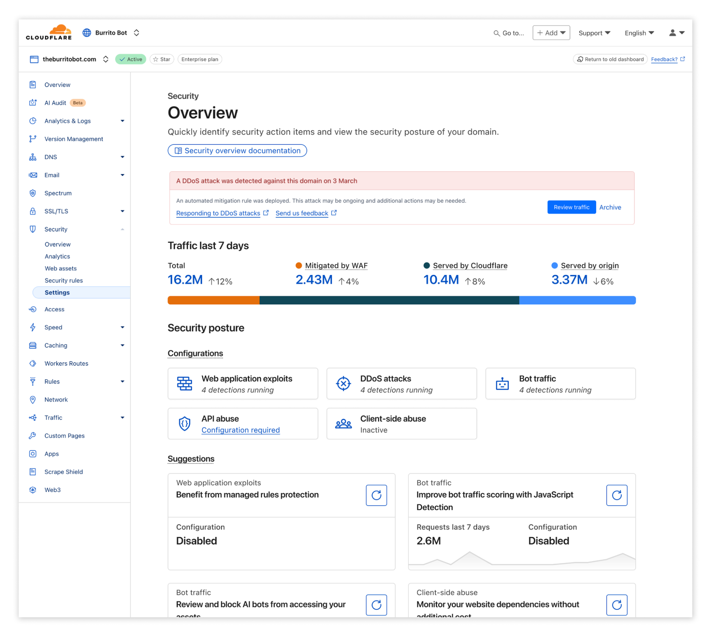
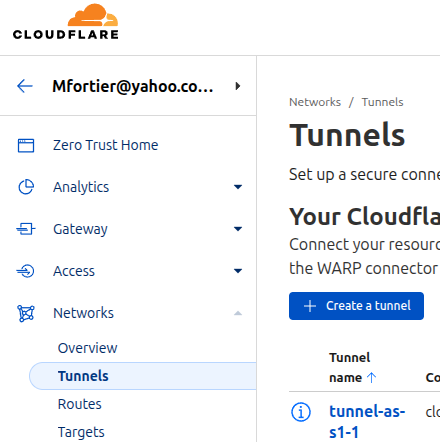

# UI Design Specification

## Overview

Customer-facing platform for Suiftly infrastructure services with a clean, professional interface.

**Related Documents:**
- **[AUTHENTICATION_DESIGN.md](./AUTHENTICATION_DESIGN.md)** - Complete authentication architecture, wallet signature flow, and JWT session management
- **[ESCROW_DESIGN.md](./ESCROW_DESIGN.md)** - Complete escrow account architecture, smart contract interface, and financial flows

**Design Principles:**
- Self-service configuration (no sales calls needed)
- Transparent pricing (see costs before enabling)
- Immediate feedback (real-time price calculations)
- Data-driven (stats and logs for observability)

**Design System:**
- **Framework:** React + TypeScript
- **Styling:** Tailwind CSS v4 (utility-first, OKLCH color space)
- **Components:** shadcn/ui (accessible, customizable)
- **Icons:** Lucide React (consistent, professional)
- **Color Palette:**
  - Primary: Blue-600 (#2563eb)
  - Background: Gray-50 (#f9fafb)
  - Borders: Gray-200 (#e5e7eb)
  - Text: Gray-900/700/500 hierarchy
  - Custom Cloudflare colors: Marine (#2F7BBF), Tangerine (#FF7900), etc.
- **Inspiration:** Enterprise SaaS dashboards (Cloudflare, Vercel, Stripe)

**Tailwind CSS v4 Notes:**
- Uses `@import "tailwindcss"` in CSS (not `@tailwind` directives)
- Config loaded via `@config "../tailwind.config.js"` in index.css
- Colors rendered in OKLCH format (perceptually uniform, better gradients)
- Write classes as normal (`text-gray-700`), OKLCH is transparent to development
- Tests checking computed colors will see `oklch(...)` instead of `rgb(...)`

**Visual Example:**


**Target Audience:**
- Web3 developers
- Blockchain infrastructure operators
- Teams building on Sui blockchain

---

## Site Architecture

### Two Separate Properties

**Landing Site: `https://suiftly.io`**
- Static marketing site (SEO-optimized)
- Technologies: Plain HTML/CSS, Astro, or Next.js (keep it simple)
- Purpose: Explain services, pricing, documentation, drive signups
- CTA: "Launch App" button → redirects to `app.suiftly.io`
- Content: Hero section, service overview, pricing table, footer
- **Note:** Separate repository or simple static pages (not part of this monorepo)

**Dashboard App: `https://app.suiftly.io`**
- React SPA (Vite + React 19)
- **Fully protected - ALL routes require wallet authentication**
- Purpose: Service configuration, monitoring, billing, API key management
- First visit: Redirects to `/login` (wallet connection page)
- After auth: Dashboard at `/` (home route)

---

## Landing Site (suiftly.io)

**Simple marketing site - not the focus of this project.**

### Page Sections

1. **Hero Section**
   - Headline: "Sui Blockchain Infrastructure, Simplified"
   - Subheadline: "Self-service Seal, gRPC, and GraphQL endpoints. Pay only for what you use."
   - CTA Button: "Launch App" (large, prominent)
   - Optional: Live stats (e.g., "Serving 12M requests/day")

2. **Services Overview**
   - Three cards: Seal, gRPC, GraphQL
   - Each card: Icon, name, 1-sentence description
   - Link to docs (if available)

3. **Pricing Section**
   - Transparent pricing table
   - Usage-based model (requests, bandwidth, etc.)
   - Calculator or example costs
   - Note: "No minimums, no contracts"

4. **Footer**
   - Links: Docs, Status, GitHub, Support
   - Social links
   - Legal: Terms, Privacy

**Implementation Note:**
- Can be added later (focus on app first)
- Initial MVP: Simple single-page HTML with "Launch App" button
- Or: Skip entirely and just use `app.suiftly.io` for everything

---

## App Architecture (app.suiftly.io)

### Layout Structure

```
┌──────────────────────────────────────────────────────┐
│ Header: Logo (left)           [Wallet Widget] (right)│
├─────────────┬────────────────────────────────────────┤
│             │                                        │
│  Sidebar    │         Main Content Area              │
│             │                                        │
│  Dashboard  │                                        │
│             │                                        │
│  Infrastructure                                      │
│  Seal     ▼ │                                        │
│    - Overview                                        │
│    - Stats  │                                        │
│  - gRPC     │                                        │
│  - GraphQL  │                                        │
│             │                                        │
│  Management │                                        │
│  - Billing & Payments                                │
│  - API Keys │                                        │
│  - User Logs│                                        │
│  ─────────  │                                        │
│  - Network Status                                    │
│  - Support  │                                        │
│             │                                        │
└─────────────┴────────────────────────────────────────┘
```

**Persistent Components:**
- Header (always visible) - Logo on left, Wallet Widget on right
- Sidebar (collapsible on mobile)
- Wallet Widget (dropdown menu when connected)

---

## Authentication & Session Flow

**Wallet-based authentication - ALL routes protected.**

See **[AUTHENTICATION_DESIGN.md](./AUTHENTICATION_DESIGN.md)** for complete technical architecture, token management, security implementation, and backend details.

### User Experience Summary

**First-Time User:**
1. Visit app.suiftly.io → Redirected to `/login`
2. Click "Connect Wallet" → Select wallet (Sui Wallet or Mock Wallet for dev)
3. Approve wallet connection → Sign authentication message
4. Authenticated → Redirected to `/dashboard`

**Returning User (Within 30 Days):**
1. Visit app.suiftly.io → Wallet auto-connects
2. Session still valid → Dashboard loads immediately (no sign-in required)

**After 30 Days:**
1. Visit app.suiftly.io → Session expired
2. Toast: "Session expired. Please sign in again."
3. Redirected to `/login` → Sign to continue

**Session Details:**
- Authentication lasts 30 days (automatic renewal happens transparently)
- Sign once per month (or less if visiting infrequently)
- Wallet auto-reconnects on return visits

**Security:**
- ALL routes require authentication (no public dashboard access)
- Traditional auth wall before accessing any dashboard content
- See [AUTHENTICATION_DESIGN.md](./AUTHENTICATION_DESIGN.md) for cryptographic proof, token storage, and session management details

---


## Sidebar Navigation

### Structure

```
┌─────────────────────┐
│ 󰕰 Dashboard         │  ← Top-level item
│                     │
│ Infrastructure      │  ← Section header
├─────────────────────┤
│ 󰤄 Seal           ▼  │  ← Collapsible with chevron
│   └ Overview        │  ← Subitem (indented)
│   └ Stats           │  ← Subitem (indented)
│ 󰖟 gRPC              │
│ 󰘦 GraphQL           │
│                     │
│ Management          │  ← Section header
├─────────────────────┤
│ 󰵀 Billing & Payments│
│ 󰌆 API Keys          │
│ 󰉻 User Logs         │
│                     │
│ ─────────────────   │  ← Divider
│                     │
│ 󰒋 Network Status    │
│ 󰋗 Support           │
└─────────────────────┘
```

**Navigation Types:**
1. **Top-level items** (no subitems): Dashboard
2. **Collapsible parent items** (with subitems): Seal
   - Shows chevron indicator (▶ closed, ▼ open)
   - Parent highlights when any child is active
   - Click parent to expand/collapse
3. **Regular items** (no subitems): gRPC, GraphQL, Billing, API Keys, Analytics & Logs, Support

**Behavior:**
- **Active highlighting:** Blue background for active item only (not parent)
  - Example: If Seal → Config is selected, only "Config" has blue background, not "Seal"
- **Collapsible sections:**
  - Seal starts open by default
  - Chevron rotates on expand/collapse
  - Smooth animation transition
- **Subitems:** Indented under parent, smaller text, selectable
- **Dark mode:** All styles adapt to dark theme

**Current Implementation:**
- Dashboard: Top-level route
- Seal: Collapsible with Overview and Stats subitems
- gRPC/GraphQL: Regular items (no subitems yet)
- Management section: Regular items (no subitems)
- Support: Regular item (no subitems)

**Initial State (New User):**
- Seal section expanded by default
- All items accessible
- Active route highlighted automatically

## Service States

**Service State Machine: 6 Distinct States**

A service (Seal, gRPC, GraphQL) exists in one of six states, controlling subscription status, service availability, and configuration access.

### State Definitions

#### **(1) Not Provisioned** (Default)

**Meaning:** No active subscription exists for this service.

**User Experience & UI:**
- Service page shows onboarding form with interactive configuration fields
- Page title: "Configure [Service Name]"
- Prominent "Subscribe to Service" button at bottom of form
- No billing charges

**Allowed Actions:**
- Browse configuration options
- Calculate pricing estimates
- Subscribe to service (transitions to State 2)

---

#### **(2) Provisioning** (Pending Payment)

**Meaning:** User has selected a tier and initiated subscription, payment is pending confirmation.

**User Experience & UI:**
- Shows the **onboarding form** (same as State 1) with loading overlay
- Banner: "Processing your subscription..." with spinner
- Form fields remain visible but disabled during payment processing
- Cannot modify tier selection or submit again during payment processing
- Return to State (1) only if payment is explicitly canceled (admin-only initially)

**Allowed Actions:**
- View selected tier (onboarding form remains visible but disabled)
- Wait for payment confirmation
- Admin: Cancel pending subscription (returns to State 1)

**Transitions:**
- **(2) → (3):** Payment confirmed → Service subscribed, defaulting to disabled state

---

#### **(3) Disabled** (Subscribed but Service OFF)

**Meaning:** Active subscription exists, but service is currently disabled by user choice.

**User Experience & UI:**
- Service page shows tab-based layout (Config / Keys)
- Configuration (normal): tab displays current settings (editable)
- Configuration (if cancelled): Everything is greyed out. No edits allowed.
- Toggle switch: [OFF] ⟳ ON
- Banner (normal): "Service is subscribed but currently disabled. Enable to start serving traffic."
- Banner (if cancelled): "Subscription cancelled. You can re-enable anytime by selecting Change Plan."
- All keys (API keys and Seal keys) return `503 Service Unavailable` when called
- **Billing:**
    if normal: User is still charged full base monthly fee (maintaining subscription/capacity reservation)
    if cancelled: There is no monthly charge. Re-enabling will incur new charges.


**Allowed Actions:**
- Edit configuration (tier, burst, keys, packages)
- Manage keys (create, revoke, copy) - keys are authenticated but return 503 when called
- Enable service (toggle switch to ON → transitions to State 4)
- Change Plan (allows user to select a different tier, re-enable, or cancel subscription)

**Transitions:**
- **(3) → (4):** User toggles service ON (immediate effect)
- **(3) → (3):** Cancel subscription via Change Plan (stays in State 3, shows cancellation message)
- **(3) → (6):** Admin suspends for non-payment

**Note:** Individual API keys and Seal keys can also be disabled independently. Disabled keys return `503` regardless of service state.

---

#### **(4) Enabled** (Subscribed and Service ON)

**Meaning:** Active subscription with service fully operational and serving traffic.

**User Experience & UI:**
- Same as Disabled, except the Service is Enabled!
- Configuration tab displays current settings (editable)
- Toggle switch: OFF ⟳ [ON]
- API/Seal keys working, traffic should be flowing normally
- User will use stats/logs to monitor health and usage.
- **Billing:** Base monthly fee + usage charges apply

**Allowed Actions:**
- Edit configuration (tier, burst, keys, packages) - **changes apply immediately without affecting traffic**
- Disable service (toggle switch to OFF → transitions to State 3)
- Manage keys (create, revoke, copy, enable/disable individual keys)
- View stats and logs (live data accumulating)

**Configuration Change Behavior:**
- **Tier changes:** Apply immediately, no traffic disruption
- **Add/remove keys/packages:** Immediate effect, billing adjusted
- **Burst enable/disable:** Takes effect immediately
- **Important:** Disabling service (State 4 → 3) is the ONLY action that stops traffic

**Transitions:**
- **(4) → (3):** User toggles service OFF (immediate effect, all keys return 503)
- **(4) → (3):** User cancel subscription
- **(4) → (5):** User initiates maintenance suspension (future feature, end-of-cycle transition)
- **(4) → (6):** Admin suspends for non-payment

---

#### **(5) Suspended - Maintenance** (Future Feature)

**Meaning:** User-initiated long-term suspension to maintain configuration and key ownership at significantly reduced cost.

**User Experience & UI:**
- Same UI state as when service is cancelled (service is disabled, everything is greyed out).
- "Resume Service" button replaces toggle switch
- Banner: "Service suspended for maintenance. Configuration and keys preserved at $2/month. Resume anytime."
- Info note: "Suspension takes effect at end of current billing cycle (DD/MM/YYYY). Current charges are non-refundable."
- All keys (API keys and Seal keys) return `503 Service Unavailable`
- In future, may allow key export feature only.
- **Billing:** Flat $2/month (no usage charges)
- **Important:** Transition to this state happens at end of current payment cycle (non-refundable if re-enabled)

**Allowed Actions:**
- View configuration (read-only)
- View keys (read-only, cannot create/revoke)
- View historical stats and logs
- Resume service (transitions to State 4 at end of cycle, or immediately with no refund)
- Change Plan (allows user to select a different tier, re-enable, or cancel subscription)

**Use Cases:**
- Planned infrastructure changes (multi-week downtime)
- Seasonal traffic patterns (pause during off-season)
- Long-term cost optimization while retaining configuration and key ownership

**Transitions:**
- **(5) → (3):** User clicks "Resume Service" (resumes to Disabled state, allowing config adjustment before re-enabling)
- **(5) → (5):** Cancel subscription via Change Plan (stays in State 5, shows cancellation message)
- **(5) → (6):** Admin suspends for non-payment

**Difference from State (3) Disabled:**
- **State (3):** Quick on/off toggle, full base monthly fee, instant effect, config changes allowed
- **State (5):** Long-term suspension, $2/month flat rate, end-of-cycle transition, config locked (simpler state management)

**Note:** Not implemented in MVP. Planned for future release.

---

#### **(6) Suspended - No Payment** (Admin-Only)

**Meaning:** Service and configuration locked due to payment failure or insufficient escrow balance.

**User Experience & UI:**
- Same as "Suspended - Maintenance", except no key export feature. The user is somewhat locked out.
- Banner: "Service suspended due to payment issues. Contact support or deposit to your account to restore service."
- **Billing:** No new charges (service frozen)

**Allowed Actions:**
- View configuration (read-only)
- View keys, stats, logs (read-only)
- Top up escrow balance (resolves suspension)
- Contact support

**Transitions:**
- **(6) → (3):** Admin resolves payment issue or user tops up balance → Service restored to disabled state

**Trigger Conditions:**
- Escrow balance reaches $0 for >7 days (grace period expired)
- Monthly spending limit exceeded (on-chain protection)
- Admin manually suspends account

**HTTP Status Code Consistency:**
- **All suspended/disabled states (3, 5, 6):** Return `503 Service Unavailable`
- **Authentication:** Always validated first (proper authentication flow)
- **Authorization:** Independent of enable/disable state

---

### State Transition Diagram

```
┌─────────────────────────────────────────────────────────────┐
│                   Service State Transitions                 │
└─────────────────────────────────────────────────────────────┘

    (1) Not Provisioned
         │
         │ User clicks "Subscribe to Service"
         ↓
    (2) Provisioning (Payment Pending)
         │
         │ Payment confirmed
         ↓
    (3) Disabled (Subscribed, Service OFF)
         │                            ↑
         │ User toggles ON            │ User toggles OFF
         ↓                            │
    (4) Enabled (Subscribed, Service ON)
         │                            │
         │ User suspends (future)     │
         ↓                            │
    (5) Suspended - Maintenance       │
         │                            │
         │ User resumes               │
         └────────────────────────────┘

    Admin Actions (from any state with subscription):
    (3), (4), (5) ──→ (6) Suspended - No Payment
    (6) ──────────→ (3) Disabled (after payment resolved)
    (3), (4), (5) ──→ (1) Not Provisioned (cancel subscription)
```

---

### Subscription Terminology Clarification

**"Subscribe to Service"** vs. **"Enable/Disable Service"**:

- **Subscribe:** Create a subscription (State 1 → 2 → 3). This reserves capacity and begins billing.
- **Enable/Disable:** Toggle service ON/OFF within an active subscription (State 3 ↔ 4). User continues to be billed base monthly fee when disabled.

**Why the distinction?**
- Avoids confusion: "Enable" used to mean both "subscribe" and "turn on traffic"
- Clearer intent: Subscribing commits to billing, enabling controls traffic flow
- Better UX: Users understand they're creating a subscription relationship first

---

### Configuration Changes by State

| State                           | Config Changes Allowed | Notes                                                        |
| ------------------------------- | ---------------------- | ------------------------------------------------------------ |
| **(1) Not Provisioned**         | ✅ Yes (form mode)     | No billing impact until subscription                         |
| **(2) Provisioning**            | ❌ No                  | Locked during payment processing                             |
| **(3) Disabled**                | ✅ Yes                 | Can prepare changes before enabling                          |
| **(4) Enabled**                 | ✅ Yes                 | Changes apply immediately **without traffic disruption**     |
| **(5) Suspended - Maintenance** | ❌ No (view-only)      | Locked during suspension, simpler state management           |
| **(6) Suspended - No Payment**  | ❌ No                  | Admin-locked until payment resolved                          |

---

### Key/Package Management by State

| State                           | Create/Revoke Keys | Notes                                     |
| ------------------------------- | ------------------ | ----------------------------------------- |
| **(1) Not Provisioned**         | ❌ No              | Must subscribe first                      |
| **(2) Provisioning**            | ❌ No              | Wait for payment confirmation             |
| **(3) Disabled**                | ✅ Yes             | Keys inactive (return 503) but manageable |
| **(4) Enabled**                 | ✅ Yes             | Full key management + keys active         |
| **(5) Suspended - Maintenance** | ❌ No (view-only)  | Cannot modify during maintenance          |
| **(6) Suspended - No Payment**  | ❌ No (view-only)  | Locked until payment resolved             |

---

### Billing Behavior by State

| State                           | Monthly Base Fee          | Usage Fees | Notes                                                   |
| ------------------------------- | ------------------------- | ---------- | ------------------------------------------------------- |
| **(1) Not Provisioned**         | ❌ No                     | ❌ No      | No billing                                              |
| **(2) Provisioning**            | ❌ No (pending)           | ❌ No      | Charge applied on transition to (3)                     |
| **(3) Disabled**                | ✅ Yes (full tier fee)    | ❌ No      | Maintains subscription/capacity reservation, no traffic |
| **(4) Enabled**                 | ✅ Yes (full tier fee)    | ✅ Yes     | Full billing (base + usage), traffic flowing            |
| **(5) Suspended - Maintenance** | ⚠️ Flat $2/month          | ❌ No      | Long-term suspension, config/keys preserved             |
| **(6) Suspended - No Payment**  | ❌ No                     | ❌ No      | Billing frozen until payment resolved                   |

---

### Design Decisions - CONFIRMED

1. **HTTP Status Codes (All States):** ✅ CONFIRMED
   - **All disabled/suspended states (3, 5, 6):** Return `503 Service Unavailable`
   - **Authentication:** Always validated before checking service state
   - **No 401 usage:** Authorization problems are independent of enable/disable state

2. **Billing in State (3) Disabled:** ✅ CONFIRMED
   - Full base monthly fee charged (maintains subscription and capacity reservation)
   - Quick on/off toggle for temporary traffic control
   - No usage fees while disabled

3. **Configuration Changes While Enabled (State 4):** ✅ CONFIRMED
   - All configuration changes (tier, burst, keys, packages) apply immediately
   - **Zero traffic disruption:** Changes do not affect serving traffic
   - Only disabling service (State 4 → 3) stops traffic flow

4. **Key Management in State (3) Disabled:** ✅ CONFIRMED
   - Keys can be created, revoked, and managed while service is disabled
   - All keys return `503` when called in disabled state
   - Individual keys can also be enabled/disabled independently (returns 503 when key is disabled)

5. **State (5) Maintenance Suspension Pricing:** ✅ CONFIRMED
   - Flat $2/month (regardless of tier)
   - Transition occurs at end of current payment cycle
   - Non-refundable if user re-enables before cycle ends

6. **State (2) Cancellation:** ✅ CONFIRMED
   - Admin-only for MVP
   - User-facing cancellation deferred to future releases

7. **Stats/Logs in Disabled State:** ✅ CONFIRMED
   - Historical stats visible from when service was previously enabled
   - New stats do not accumulate while disabled
   - Logs preserve all state transitions and configuration changes
   - Enabling/disabling service creates log entries

---

## Main Content Areas

### Common Elements

#### Banner Section
At the top of the main content area. Each banner intended to be brief (one liner) with an icon to show severity (info, warning, error). More than one banner might be displayed.

The section does not have a title and takes no vertical space when there are no banners to show.

Any banners just push down the rest of the content.

The banners displayed here are relevant only to the service/page content, not the entire app.

A banner can optionally have a small spinner appended.

#### Toasters
Top-middle of the screen, fade out after 3 seconds. Used for non-critical feedback after a user action (e.g. "Configuration saved", "Wallet connected", etc.)

### Service Pages (Seal / gRPC / GraphQL)

**URL Pattern:** `/services/seal`, `/services/grpc`, `/services/graphql`

Each service page has **2 major modes of operation**:

1. **Onboarding Form**. For when the service state are (1) Not Provisioned and (2) Provisioning. Traditional submit pattern after the user select the service tier.

2. **Interactive Form** This is for all other service states (e.g. Disabled, Enabled, Suspended...). Field level actions with immediate effect. No single "submit" button.

**Note:** For MVP, only the Seal service is fully implemented. gRPC and GraphQL show "coming soon" placeholders (see [docs/COMING_SOON_PAGE.md](../docs/COMING_SOON_PAGE.md)).

---

#### Seal Onboarding Form (Service State 1 & 2)

```
┌──────────────────────────────────────────────────────┐
│ Seal Configuration                                   │
│                                                      │
│  Per-Request Pricing (i)                             │
│    • $1 per 10,000 requests                          │
│                                                      │
│  Guaranteed Bandwidth (?)                            │
│                                                      │
│  ┌───────────────────────────────────────────┐       │
│  │ STARTER                                   │       │
│  ├───────────────────────────────────────────┤       │
│  │ 3 req/s per region • ~9 req/s globally    │       │
│  │ $9/month                                  │       │
│  └───────────────────────────────────────────┘       │
│                                                      │
│  ┌───────────────────────────────────────────┐       │
│  │ PRO                         [SELECTED]    │       │
│  ├───────────────────────────────────────────┤       │
│  │ 15 req/s per region • ~45 req/s globally  │       │
│  │ $29/month                                 │       │
│  └───────────────────────────────────────────┘       │
│                                                      │
│  ┌───────────────────────────────────────────┐       │
│  │ ENTERPRISE                                │       │
│  ├───────────────────────────────────────────┤       │
│  │ 100 req/s per region • ~300 req/s globally│       │
│  │ $185/month                                │       │
│  └───────────────────────────────────────────┘       │
│                                                      │
│  ✓ Included with every subscription                  │
│    • Global geo-steering and failover (i)            │
│    • 1x Seal Key, 3x packages id                     │
│    • 2x API-Key                                      │
│    ...                                               │
│                                                      │
│  Optional add-ons are available (i)                  │
│                                                      │
│     [ ] Agree to terms of service                    │
│                                                      │
│  ┌──────────────────────────────────────────┐        │
│  │ Subscribe to Service for $55.00/month    │        │
│  └──────────────────────────────────────────┘        │
│                                                      │
└──────────────────────────────────────────────────────┘
```

**Behavior:**
- **Tooltips (i):** Click to show explanation
- **Tier Cards** User can switch between tiers and price on bottom button is updated.
- **Terms of service** link opens a modal window that can be scrolled down for the TOS, and download as PDF button and "Agree and close" button. The user can also simply checkbox the "Agree" without clicking the link.
- **DB Driven**: All numbers (pricing, capacities) are DB driven *but can be heavily cached or used to generate static content*.

#### Seal Interactive Form (Service State >= 3)

```
┌─────────────────────────────────────────────────────┐
│ Seal                                                │
│                                                     │
│  Enable Service                         OFF ⟳ [ON] │
│  [ Configuration ]  [ Keys ]                        │  ← Tabs
│  ────────────────                                   │
│                                                     │
|  Monthly Charges - ENTERPRISE [Change Plan]         |
|                                                     |
│  Guaranteed Bandwidth:      2K req/s/region   $9.00 │
|  Seal Keys            (1 of 1)  [Add More]     0.00 │
|  IPv4 Allowlist       (1 of 1)  [Add More]     0.00 │
|  Packages per Key           5   [Add More]    $2.00 │
│                                                     │
│                ┌───────────────────────────────────┐│
│                │ Total Monthly Fee           $11.00││
│                └───────────────────────────────────┘│
│                                                     │
│  Pending Per-Request Charges: $0.00 [See Details]   |
│                                                     │
│  Burst Allowed:            OFF ⟳ [ON]              │
│                                                     │
│  IP Allowlist (?)                                   │
│  ┌──────────────────────────────────────────┐       │
│  │ 192.168.1.100                            │       │
│  │ 10.0.0.0/24                              │       │
│  └──────────────────────────────────────────┘       │
│                                                     │
└─────────────────────────────────────────────────────┘
```


**Tab 1: Configuration**

- **ON/OFF**
  - Type: Slider switch
  - Default: Disabled
  - Controls if the service is enabled or disabled.

- **Monthly Charged Items Table**
  - Title shows tier (STARTER/PRO/ENTERPRISE) with [Change Plan] button next to it.
  - 4 columns: Description | Usage/Count | [Add More] button | Monthly Price (Total)
  - Show tier details as Guaranteed Bandwidth on next line (e.g 3 req/s per region)
  - Displays other various items that are included or can be add-on.
  - When applicable, display which portion of the included/paid items are being used e.g (0 of 3),(3 of 3)
  - Total monthly is shown.

- **Pending Per-Request Charges**
  - Shows only pending total, [See Details] Will bring up the stats page which covers usage breakdown.

- **Burst (?)**
  - Type: Checkbox
  - Default: Checked for Pro and Enterprise tiers
  - Grayed out for Starter tier with label "Pro/Enterprise feature"
  - Tooltip: "Allow temporary traffic bursts beyond guaranteed bandwidth. Billed per-request for burst traffic."
  - Pricing: No monthly fee (usage-based billing only)
  - Future: May add premium burst tier with higher priority at additional monthly cost

- **IP Allowlist (?)**
  - Type: Multi-line text area or tag input
  - Default: Empty (no IP restrictions)
  - Pro/Enterprise: Up to 2 IPv4 addresses
  - Enterprise only: Up to 2 CIDR ranges (in addition to IPv4 addresses)
  - Grayed out for Starter tier with label "Pro/Enterprise feature"
  - Tooltip: "Restrict API access to specific IP addresses or CIDR ranges. Leave empty to allow all IPs."
  - Format: Accepts space, newline, or comma as delimiters (e.g., "192.168.1.100, 10.0.0.0/24" or one per line)
  - Validation: Validates IPv4 format and CIDR notation
  - Pricing: Included with Pro/Enterprise tiers (no additional cost)

**Note:** When gRPC and GraphQL are implemented in the future, they will use similar interactive form and pricing model as Seal.

---

**Tab 2: Keys**

```
┌──────────────────────────────────────────────────────┐
│  Keys & Packages                                     │
│                                                      │
│                                                      │
│  Seal Keys & Packages (1 of 1) used                  │
│  ┌────────────────────────────────────────┐          │
│  │  seal_xyz789...  [Export] [Disable] [▼]│          │
|  |  Object ID: 0xabcde... [Copy]          │          │
│  │                                        │          │
│  │  Packages (4 of 5) Used                │          │
│  │    • package-1  [Edit] [Delete]        │          │
│  │    • package-2  [Edit] [Delete]        │          │
│  │    • package-3  [Edit] [Delete]        │          │
│  │    • package-4  [Edit] [Delete]        │          │
│  │    • package-5  [Edit] [Delete]        │          │
│  │                                        │          │
│  │    [ Add Package to this Seal Key ]    │          │
│  └────────────────────────────────────────┘          │
│                         [ Add New Seal Key ]         │
│                                                      │
│  API Keys (1 of 2) used                              │
│  ┌────────────────────────────────────────┐          │
│  │  key_abc123...  [Copy] [Revoke]        │          │
│  └────────────────────────────────────────┘          │
│                          [ Add New API Key ]         │
└──────────────────────────────────────────────────────┘
```

**Hierarchy:** Service → Seal Keys → Packages (each seal key owns its packages)
               Service → API Keys (independent of seal keys)

**Keys Tab Behavior (After Service Enabled):**
- **Seal Keys & Packages Section:**
  - Each seal key has an expandable card ([▼] to collapse/expand)
  - Seal key is shown truncated (first 6 + last 4 chars). Need to press [Export] to see full key.

  - **Seal Key actions:**
    - Export → Shows key in a modal for copying.
    - Disable → Disable seal key (confirmation required)
    - Enable (if disabled) → Re-enables key
    - Delete (if disabled) → Remove key (confirmation required, dangerous not recoverable)
    - Add New Seal Key → Give choice to import or generate new one.

  - **Object ID** shows (truncated) once the seal key is registered or imported. It has a
  copy to clipboard" button.

  - **Packages (nested under each seal key):**
    - Packages are children of their parent seal key
    - Each package shows: address truncated + [Edit] [Delete] actions
    - Edit → Change package address
    - Delete → Remove package (confirmation needed)
    - **"Add Package to this Seal Key":**
      - Creates new package under this seal key.


- **API Keys Section:**
  - List of active API keys (truncated display)
  - Copy button → Copies full key to clipboard
  - Revoke button → Disables key (confirmation required)
  - Enable button (if revoked) → Re-enables key
  - Delete button → Remove key forever (confirmation required)
  - **"Add New API Key":**
    - Creates new key (+$1/month to add if all used).

**Note:** Adding/deleting keys or packages may updates monthly fee and triggers billing events.
          Keys are encrypted in DB for security, and have fingerprint used for internal coordination.

### Anti-Abuse & Rate Limiting (Key Operations)

**Rate Limits (Per Wallet Address):**
- **API Key Create/Revoke:** Max 5 operations per hour
- **Seal Key Create/Revoke:** Max 3 operations per hour
- **Package Add/Delete:** Max 10 operations per hour
- **Config Updates (billing changes):** Max 2 per hour

**Minimum Time Windows:**
- Cannot revoke a key within 5 minutes of creation (prevents accidental spam)
- Cannot change billing-impacting config more than twice per 5 minutes

**Abuse Detection & Throttling:**
- Backend monitors for rapid create/revoke cycles
- If detected: Throttle operations + show warning: "Too many changes. Please wait {minutes} before trying again."
- If repeated abuse: Temporary account lock (manual review required)

**Billing Implications:**
- All billing changes (add/remove keys, packages, config) are logged with wallet signature
- Prevents disputes: "You authorized this change at {timestamp}"
- Pro-rated charges/credits prevent gaming the system (e.g., rapid add/remove cycles)

### Stats Pages (Seal / gRPC / GraphQL)

**URL:** `services/seal/stats`

**Tab 4: Stats**
```
┌──────────────────────────────────────────────────────┐
│  Stats                                               │
│                                                      │
│  ⓘ Stats are updated hourly. Data appears after     │
│     24 hours of service activity.                    │
│                                                      │
│  Requests (Last 7 Days)                              │
│  ┌────────────────────────────────────────┐          │
│  │                                        │          │
│  │     [Empty graph placeholder]          │          │
│  │                                        │          │
│  └────────────────────────────────────────┘          │
│                                                      │
│  Bandwidth Usage (Last 7 Days)                       │
│  ┌────────────────────────────────────────┐          │
│  │                                        │          │
│  │     [Empty graph placeholder]          │          │
│  │                                        │          │
│  └────────────────────────────────────────┘          │
│                                                      │
│  Response Time (p50/p95/p99)                         │
│  ┌────────────────────────────────────────┐          │
│  │                                        │          │
│  │     [Empty graph placeholder]          │          │
│  │                                        │          │
│  └────────────────────────────────────────┘          │
│                                                      │
└──────────────────────────────────────────────────────┘
```

**Stats Tab Behavior:**
- **Always show graph placeholders** (even when empty)
- **Info banner:** "Stats updated hourly. Data appears after 24 hours."
- **Purpose:** Show users what observability they'll get
- **Graphs to show (empty initially):**
  - Requests over time (line chart)
  - Bandwidth usage (area chart)
  - Response times (multi-line: p50, p95, p99)
  - Optional: Error rate, geographic distribution

**Tab 2: Logs**

```
┌──────────────────────────────────────────────────────┐
│  Activity Log                                        │
│                                                      │
│  ┌────────────────────────────────────────┐          │
│  │ Jan 9, 2025 14:23                      │          │
│  │ Service enabled                        │          │
│  │ Configuration: 2 endpoints, US-East    │          │
│  ├────────────────────────────────────────┤          │
│  │ Jan 9, 2025 14:25                      │          │
│  │ Charge: $45.00                         │          │
│  │ Monthly base fee for January           │          │
│  ├────────────────────────────────────────┤          │
│  │ Jan 10, 2025 09:15                     │          │
│  │ Configuration updated                  │          │
│  │ Changed: Endpoints 2 → 3               │          │
│  ├────────────────────────────────────────┤          │
│  │ Jan 10, 2025 09:15                     │          │
│  │ Charge: $10.00                         │          │
│  │ Pro-rated charge for additional endpoint│         │
│  └────────────────────────────────────────┘          │
│                                                      │
│                           [ Load More ]              │
│                                                      │
└──────────────────────────────────────────────────────┘
```

**Logs Tab Content:**
- **Configuration changes:** When user edits settings
- **Charges/Credits:** Billing events (monthly charges, pro-rated changes)
- **Service events:** Enabled/disabled, errors
- **Format:** Reverse chronological (newest first)
- **Pagination:** "Load More" button at bottom

**Note:** Logs are audit trail + transparency (users see exactly what they're charged for).

---

### Support Page

**URL:** `/support`

**Purpose:** Help resources and contact information.

```
┌──────────────────────────────────────────────────────┐
│ Support                                              │
│                                                      │
│  Contact Us                                          │
│  ┌────────────────────────────────────────┐          │
│  │  Email: support@mhax.io                │          │
│  │  Response time: 24-48 hours            │          │
│  └────────────────────────────────────────┘          │
│                                                      │
│  Community                                           │
│  ┌────────────────────────────────────────┐          │
│  │  [Discord] Join our Discord server     │          │
│  │  Get help from the community           │          │
│  └────────────────────────────────────────┘          │
│                                                      │
│  Frequently Asked Questions                          │
│  ┌────────────────────────────────────────┐          │
│  │  ▶ How do I configure my first service?│          │
│  │  ▶ What is guaranteed bandwidth?       │          │
│  │  ▶ How does burst pricing work?        │          │
│  │  ▶ How do I generate additional keys?  │          │
│  │  ▶ What payment methods are supported? │          │
│  │  ▶ How do I cancel a service?          │          │
│  └────────────────────────────────────────┘          │
│                                                      │
└──────────────────────────────────────────────────────┘
```

**Sections:**

1. **Contact Us**
   - Email: `support@mhax.io` (clickable mailto link)
   - Expected response time
   - Optional: Add contact form later

2. **Community**
   - Discord invite button/link (will be defined later)
   - Brief description: "Get help from the community"

3. **Frequently Asked Questions**
   - Collapsible accordion (▶ expands to ▼)
   - Common questions with detailed answers
   - Examples:
     - How do I configure my first service?
     - What is guaranteed bandwidth?
     - How does burst pricing work?
     - How do I generate additional keys?
     - What payment methods are supported?
     - How do I cancel a service?
   - Can be expanded as needed

**Note:** Keep support page simple for MVP. Can add knowledge base, video tutorials, API docs later.

---

### Page 3: Billing

**URL:** `/billing`

**Purpose:** Consolidated view of all usage, charges, and wallet balance.


## Billing and Payments Page

**URL:** `/billing`

**Purpose:** Manage on-chain escrow spending protections, view balance, and control spending limits.


### Account Section

### Spending Limits Section

**Note:** Spending limits is part of the main billing page, not a separate route.
```
┌──────────────────────────────────────────────────────┐
│ Billing → Spending Limit                             │
│                                                       │
│  Monthly Spending Limit (On-Chain Protection)        │
│                                                       │
│  ⓘ This limit protects your escrow account from     │
│     excessive charges. Changes require wallet         │
│     signature to update the smart contract.           │
│                                                       │
│  Current Limit: $500 per month (calendar month)     │
│                                                       │
│  [━━━━━━━━━━━━━━━━━━━] $85 / $500               │
│  This month: $680 (34%) - Resets in 12 days          │
│                                                       │
│  Recent charges:                                      │
│  • Jan 9: Service enabled - $60                       │
│  • Jan 15: Tier upgrade - $20                         │
│  • Jan 18: Added 10 API keys - $10                    │
│  • Jan 28: Monthly usage fees - $590                  │
│                                                       │
│  [ Change Limit ]                                     │
│                                                       │
│  ─────────────────────────────────────                │
│                                                       │
│  Withdrawal Protection                                │
│                                                       │
│  ⓘ Minimum balance required while services active:  │
│     $50.00 (prevents accidental service interruption) │
│                                                       │
│  Active services: 1 (Seal)                            │
│  Current balance: $127.50                             │
│  Available to withdraw: $77.50                        │
│                                                       │
│  [ Withdraw Funds ]                                   │
│                                                       │
└──────────────────────────────────────────────────────┘
```

**Change Spending Limit Modal:**
```
┌──────────────────────────────────────────────────────┐
│ Change Monthly Spending Limit                        │
│                                                       │
│  Current limit: $500 per month                      │
│  Spent this month: $680                               │
│                                                       │
│  New limit: [$ 5000  ]  (min: $20, unlimited)    │
│                                                       │
│  Suggested:                                           │
│  • $500/month  - Single service (Starter/Pro)        │
│  • $500/month - Default (see CONSTANTS.md)               │
│  • $5,000/month - Heavy usage / multiple services    │
│                                                       │
│  ⓘ This change requires a wallet signature to       │
│     update the on-chain escrow contract.              │
│                                                       │
│  [ Update Limit ]  [ Cancel ]                         │
│                                                       │
└──────────────────────────────────────────────────────┘
```

**Interactions:**
- Clicking [Change Limit] opens modal
- User enters new value (validated: min $100, max $50,000)
- Clicking "Update Limit" triggers wallet signature request
- On-chain transaction updates escrow contract config
- Toast: "Monthly spending limit updated: $5,000"
- Activity log: "Monthly spending limit changed: $500 → $1,000"

**Tooltip:**
- **Monthly Limit:** "Maximum Suiftly can charge in any 30-day rolling window. Protects your escrow from excessive billing."

---

**State 1: Wallet Not Connected (Demo Mode)**
```
┌──────────────────────────────────────────────────────┐
│ Billing & Usage                                       │

│                                                       │
│  ⓘ Connect your wallet to view billing information  │
│                                                       │
│  ┌────────────────────────────────────────┐          │
│  │                                        │          │
│  │     [Connect Wallet]                   │          │
│  │                                        │          │
│  │  Connect to view:                      │          │
│  │  • Wallet balance                      │          │
│  │  • Current month charges               │          │
│  │  • Usage details                       │          │
│  │  • Billing history                     │          │
│  │                                        │          │
│  └────────────────────────────────────────┘          │
│                                                       │
└──────────────────────────────────────────────────────┘
```

**State 2: Wallet Connected**
```
┌──────────────────────────────────────────────────────┐
│ Billing & Usage                                       │
│                                                       │
│  Wallet Balance                      $127.50         │
│  ┌────────────────────────────────────────┐          │
│  │  [ Top Up ]  [ Withdraw ]             │          │
│  └────────────────────────────────────────┘          │
│                                                       │
│  Current Month (January 2025)                         │
│  ┌────────────────────────────────────────┐          │
│  │  Seal Service              $46.25      │          │
│  │  gRPC Service              $12.00      │          │
│  │  GraphQL Service            $8.50      │          │
│  │  ─────────────────────────────────     │          │
│  │  Total                     $66.75      │          │
│  └────────────────────────────────────────┘          │
│                                                       │
│  Usage Details (Current Month)                        │
│  ┌────────────────────────────────────────┐          │
│  │  Service    │ Requests  │ Cost         │          │
│  ├────────────────────────────────────────┤          │
│  │  Seal       │ 125,000   │ $12.50       │          │
│  │  gRPC       │ 32,000    │ $3.20        │          │
│  │  GraphQL    │ 18,000    │ $1.80        │          │
│  └────────────────────────────────────────┘          │
│                                                       │
│  Billing History                                      │
│  ┌────────────────────────────────────────┐          │
│  │  Jan 1, 2025   Invoice #001   $66.75  │          │
│  │  Dec 1, 2024   Invoice #000   $54.20  │          │
│  │  ...                                   │          │
│  └────────────────────────────────────────┘          │
│                                                       │
└──────────────────────────────────────────────────────┘
```

**Sections:**

1. **Wallet Balance (Top)**
   - Current balance (large, prominent)
   - "Top Up" button → Opens wallet deposit modal
   - "Withdraw" button → Opens wallet withdrawal modal

2. **Current Month Summary**
   - Breakdown by service
   - Total charges
   - Note: Auto-charged from wallet balance

3. **Usage Details**
   - Table showing usage metrics per service
   - Current billing period (month-to-date)

4. **Billing History**
   - List of past invoices (monthly)
   - Click invoice → View detailed breakdown

**Wallet Integration:**
- Balance synced with Web3 wallet escrow
- Top-up → Deposit SUI tokens to escrow
- Withdraw → Release SUI tokens from escrow
- Auto-billing: Charges deducted from balance automatically

### Billing & Currency Model

**See [ESCROW_DESIGN.md](./ESCROW_DESIGN.md) for complete escrow account architecture, protections, and flows.**

**Summary:**

**Canonical Currency: USD (denominated), SUI (settled)**

All prices displayed in USD, but payments/deposits/withdrawals use SUI tokens on Sui blockchain.

**Key UX Elements (detailed flows in [ESCROW_DESIGN.md](./ESCROW_DESIGN.md)):**

- **Rate Display:** Always show SUI/USD rate with timestamp and source count
  - Example: "1 SUI = $2.45 (updated 47s ago, from 3 sources)"

- **Escrow Account Model:**
  - User deposits once → Suiftly auto-charges for services (no repeated signatures)
  - Balance shown in USD throughout UI
  - User can withdraw anytime (minimum $50 if services active)

- **Monthly Spending Limit (On-Chain):**
  - Default: $500/month (user-adjustable: $20-unlimited, see CONSTANTS.md)
  - Enforced by smart contract
  - User sets limit on first deposit

- **Proactive Validation:**
  - Frontend validates balance + monthly limit in real-time
  - "Save Changes" button disabled if insufficient funds or would exceed limit
  - Clear error banners show exact problem and solution
  - No failed save attempts

- **Charging Behavior:**
  - Immediate: Service enable, tier changes, add keys/packages
  - Deferred: Usage fees (end of month)
  - Credits: Instant (revoke keys, tier downgrades)

- **Low Balance Warnings:**
  - Balance < estimate: Warning toast
  - Balance < $10: Warning banner on all pages
  - Balance = $0: Service paused, 7-day grace period

**See [ESCROW_DESIGN.md](./ESCROW_DESIGN.md) for:**
- Complete deposit/withdrawal flows
- Smart contract interface
- Database schema
- Ledger reconciliation details
- Security considerations
- Testing scenarios

---

## Header Components

### Simplified Header (No Wallet Widget)

**Header shows:**
```
┌─────────────────────────────────────────────┐
│  Logo  Suiftly BETA          [0x1a2b... ▼]  │
└─────────────────────────────────────────────┘
```

**Components:**
- Logo: "Suiftly" with BETA badge
- Wallet address button (right side) - shows dropdown with Copy Address and Disconnect

**Dropdown Menu (Click address):**
```
┌─────────────────────────────┐
│  Copy Address               │
│  Disconnect                 │
└─────────────────────────────┘
```

**Actions:**
- **Copy Address:** Copies full wallet address to clipboard
- **Disconnect:** Logs out and redirects to /login

**No Balance in Header:**
- Balance, deposits, withdrawals all managed on `/billing` page
- Keeps header clean and focused
- All financial operations in one place

**Development Mock:**
- Login page shows both "Connect Wallet" and "Connect Mock Wallet" buttons
- After auth, header shows address (real or mock)

---

## Key User Flows

### Flow 1: First-Time User

```
1. Visit app.suiftly.io
   ↓
2. Not authenticated → Redirected to /login
   ↓
3. Login page shows:
   - Suiftly logo
   - "Sign in with your Sui wallet to access the dashboard"
   - [Connect Wallet] button
   ↓
4. Click "Connect Wallet" → Select wallet (Sui Wallet or Mock Wallet for dev)
   ↓
5. Wallet popup → Approve connection
   ↓
6. Wallet prompts to sign authentication message
   ↓
7. Authentication successful
   ↓
8. Redirected to /dashboard
   ↓
9. Dashboard loads with:
   - Header: Logo + Wallet address dropdown
   - Sidebar: Services, Billing, API Keys, Logs, Support
   - Main content: Overview page
   ↓
10. User navigates sidebar to explore or configure services
```

**Authentication Requirements:**
- All routes require authentication (no public dashboard access)
- Users must connect wallet before accessing any dashboard content
- See [AUTHENTICATION_DESIGN.md](./AUTHENTICATION_DESIGN.md) for technical implementation

---

### Flow 2: Subscribe to First Service (Onboarding)

```
1. User navigates to /services/seal (already authenticated)
   ↓
2. Onboarding form visible (tier selection only)
   ↓
3. Select tier: Pro (shows $100/month base price)
   ↓
4. Click tooltips (?) to learn about guaranteed bandwidth and features
   ↓
5. Review per-request pricing ($0.0001/req, $1 per 10K requests)
   ↓
6. Check "Agree to terms of service" checkbox
   ↓
7. Click "Subscribe to Service for $100.00/month" button
   ↓
8. Service provisioning (State: Provisioning, spinner shown)
   ↓
9. Backend provisions service infrastructure
   ↓
10. Service moves to Disabled state (State: Disabled)
    ↓
11. Page updates to show Interactive Form (Config tab active)
    ↓
12. User can now configure: burst, IP allowlist, and future add-ons
    ↓
13. User clicks [Enable Service] toggle
    ↓
14. Service enabled (State: Enabled)
    ↓
15. Escrow balance charged: $100.00 (pro-rated for current month)
    ↓
16. Toast: "Seal service enabled. $100.00 charged."
```

**Note:**
- Onboarding (State: NotProvisioned) only allows tier selection and ToS acceptance
- After provisioning completes (State: Disabled), user can configure burst, packages, IP allowlist, etc.
- Service must be explicitly enabled to start billing
- Charges are auto-deducted from escrow balance (no wallet signature required)

---

### Flow 3: Edit Existing Service Configuration

```
1. User on /services/seal (configured state, Config tab active)
   ↓
2. Click [Edit 󰏫] icon (top-right of config section)
   ↓
3. Modal opens with current config pre-filled
   ↓
4. Change tier: Starter ($20) → Pro ($40)
   ↓
5. See new Monthly Estimate: $40.00 (live calculation updates)
   ↓
6. See note: "You'll be charged $X.XX (pro-rated) immediately from your escrow balance"
   ↓
7. Balance validation (if insufficient, error shown: "Insufficient balance. Top up required.")
   ↓
8. Click "Save Changes"
   ↓
9. Saving spinner shown
   ↓
10. Configuration updated successfully
    ↓
11. Modal closes
    ↓
12. Balance updates: $127.50 → $117.50 (example: $10 pro-rated charge)
    ↓
13. Logs tab shows new entry: "Configuration updated - Pro tier enabled - Charged $10.00 (pro-rated)"
    ↓
14. Toast: "Configuration updated. $10.00 charged from escrow balance."
```

**Downgrade Example (Credit Applied):**
```
User changes tier: Pro ($40) → Starter ($20)
→ Pro-rated credit: +$X.XX added to escrow balance
→ Toast: "Configuration updated. $X.XX credit applied to your balance."
→ Balance increases immediately
→ User can withdraw credit at any time
```

**Note:** All charges/credits auto-deducted from escrow balance (no wallet signature needed for config changes).

---

### Flow 4: Top-Up Balance (Deposit to Escrow)

```
1. Navigate to /billing (or click wallet address dropdown → "Billing & Balance")
   ↓
2. Click "Top Up" button
   ↓
3. Modal opens: "Deposit Funds to Escrow"
   ↓
4. Enter amount: $100
   ↓
5. See conversion: "Deposit ~40.82 SUI to escrow (rate: 1 SUI = $2.45, from 3 sources, updated 23s ago)"
   ↓
6. Click "Deposit"
   ↓
7. Wallet popup → Approve blockchain transaction to Suiftly escrow contract
   ↓
8. Transaction submitted → Modal shows "Pending confirmation... (TX: 0xabc123...)"
   ↓
9. Confirmation progress: 0 → 1 → 2 → 3 confirmations (~3-5 seconds)
    ↓
10. Transaction finalized (3 confirmations)
    ↓
11. Balance updates: $127.50 → $227.50
    ↓
12. Modal closes
    ↓
13. Toast: "Deposit successful. +$100.00 added to your escrow balance."
    ↓
14. Activity log shows: "Deposit: +$100.00 (40.82 SUI) - TX: 0xabc123..."
```

**Note:** Once deposited, Suiftly can auto-charge for services without additional wallet signatures. User can withdraw remaining balance at any time.

---

## Component Inventory

### Layout Components

| Component | Purpose | Location |
|-----------|---------|----------|
| `DashboardLayout` | Main layout wrapper (header + sidebar + content) | `components/layout/` |
| `Header` | Logo + wallet widget + user menu | `components/layout/` |
| `Sidebar` | Service navigation + billing link | `components/layout/` |
| `ServiceLayout` | Tab wrapper for service pages | `components/layout/` |
| `DemoModeBanner` | Info banner shown when wallet not connected | `components/layout/` |

### Wallet Components

| Component | Purpose | Location |
|-----------|---------|----------|
| `WalletButton` | Address dropdown (Copy/Disconnect) in header | `components/wallet/` |
| `DepositModal` | Top-up funds modal (billing page) | `components/billing/` |
| `WithdrawModal` | Withdraw funds modal (billing page) | `components/billing/` |
| `TransactionsList` | Recent transactions (billing page) | `components/billing/` |

### Service Components

| Component | Purpose | Location |
|-----------|---------|----------|
| `ServiceConfigForm` | Onboarding form | `components/services/` |
| `ServiceConfigDisplay` | Read-only config view | `components/services/` |
| `ServiceTabs` | Tab navigation (Config/Keys/Stats/Logs) | `components/services/` |
| `PricingCalculator` | Live monthly fee calculator | `components/services/` |
| `UsageFeesList` | Enumerated usage fees | `components/services/` |
| `TierSelector` | Horizontal tier cards with selection state | `components/services/` |
| `TierCard` | Individual tier card (clickable, shows selection) | `components/services/` |
| `SelectedBadge` | "SELECTED" pill badge for tier cards | `components/services/` |
| `IncludedFeaturesBanner` | Always-included features info banner | `components/services/` |
| `TooltipField` | Form field with (?) tooltip | `components/services/` |

### Stats Components

| Component | Purpose | Location |
|-----------|---------|----------|
| `StatsPlaceholder` | Empty graph with title | `components/stats/` |
| `RequestsChart` | Requests over time (line chart) | `components/stats/` |
| `BandwidthChart` | Bandwidth usage (area chart) | `components/stats/` |
| `ResponseTimeChart` | Latency metrics (multi-line) | `components/stats/` |

### Billing Components

| Component | Purpose | Location |
|-----------|---------|----------|
| `BillingOverview` | Current month summary | `components/billing/` |
| `UsageTable` | Usage breakdown by service | `components/billing/` |
| `InvoiceList` | Past invoices | `components/billing/` |
| `InvoiceDetail` | Detailed invoice view | `components/billing/` |

### Keys Components

| Component | Purpose | Location |
|-----------|---------|----------|
| `KeysList` | Display API/Seal keys with actions | `components/keys/` |
| `KeyCard` | Individual key display (copy/revoke) | `components/keys/` |
| `AddKeyButton` | Add new key (shows modal) | `components/keys/` |
| `SealKeyCard` | Expandable seal key with nested packages | `components/keys/` |
| `PackagesList` | Manage packages nested under seal keys | `components/keys/` |
| `KeysPlaceholder` | Pre-enable info message | `components/keys/` |

### Support Components

| Component | Purpose | Location |
|-----------|---------|----------|
| `ContactCard` | Email contact info | `components/support/` |
| `FAQAccordion` | Collapsible FAQ items | `components/support/` |
| `CommunityLinks` | Discord invite, community links | `components/support/` |

### UI Components (shadcn/ui)

| Component | Usage |
|-----------|-------|
| `Button` | All buttons (primary/secondary/ghost) |
| `Card` | Config cards, pricing cards |
| `Modal` | Edit config, deposit/withdraw, add keys, "Connect Wallet Required" |
| `Tabs` | Service page tabs (Config/Keys/Stats/Logs) |
| `Table` | Usage table, invoice list |
| `Input` | Form fields (number inputs for keys/packages) |
| `RadioGroup` | Tier selection (Starter/Pro/Business) |
| `Checkbox` | Burst enable/disable |
| `Toast` | Success/error notifications |
| `Tooltip` | Help text for (?) icons |
| `Accordion` | FAQ items |

---

## Routing Structure

### Routes (TanStack Router)

**All routes protected - require wallet authentication**

```
/login                         → Login page (only public route - wallet connection)

Protected routes (require authentication):
/                              → Redirects to /dashboard (if authenticated) or /login (if not authenticated)
/dashboard                     → Dashboard home page
/services/seal                 → Seal service configuration
/services/grpc                 → gRPC service (coming soon placeholder)
/services/graphql              → GraphQL service (coming soon placeholder)
/billing                       → Billing, balance, deposits, withdrawals, spending limits
/support                       → Support and help resources
```

**Route Protection:**
- **Public route:** `/login` only
- **Protected routes:** All dashboard routes
- **Redirect behavior:** Not authenticated → `/login`, Authenticated on `/login` → `/`

**Route State:**
- Service page state (configured vs. not configured) determined by API data
- Active tab state stored in URL params (e.g., `/services/seal?tab=stats`)

---

## Form Schemas (Zod)

### Service Config (Seal Service)

**For MVP, this schema applies to the Seal service only. Future services (gRPC, GraphQL) will use the same schema when implemented.**

```typescript
const serviceConfigSchema = z.object({
  guaranteedBandwidth: z.enum(['starter', 'pro', 'enterprise']),
  burstEnabled: z.boolean(),
  packagesPerSealKey: z.number().min(3), // Comes with 3, can add more
  totalApiKeys: z.number().min(1),       // Total API keys (1 included)
  totalSealKeys: z.number().min(1),      // Total Seal keys (1 included)
}).refine((data) => {
  // Burst only available for Pro and Business
  if (data.burstEnabled && data.guaranteedBandwidth === 'starter') {
    return false
  }
  return true
}, {
  message: "Burst is only available for Pro and Enterprise tiers",
  path: ["burstEnabled"]
})
```

**Pricing Constants:**
```typescript
const PRICING = {
  tiers: {
    starter: { base: 20, reqPerSec: 100 },
    pro: { base: 40, reqPerSec: 500 },
    enterprise: { base: 80, reqPerSec: 2000 },
  },
  // burst: No monthly fee (usage-based billing only)
  additionalPackagePerKey: 1, // $1/month per package (after 3) per seal key
  additionalApiKey: 1, // $1/month per key (after 1)
  additionalSealKey: 5, // $5/month per key (after 1)
}

// Calculate monthly fee
function calculateMonthlyFee(config: ServiceConfig): number {
  let total = PRICING.tiers[config.guaranteedBandwidth].base

  // Burst has no monthly fee (usage-based billing only)

  // Additional API keys cost (1 included)
  total += Math.max(0, config.totalApiKeys - 1) * PRICING.additionalApiKey

  // Additional seal keys cost (1 included)
  total += Math.max(0, config.totalSealKeys - 1) * PRICING.additionalSealKey

  // Packages cost: per seal key, 3 included per key
  const additionalPackagesPerKey = Math.max(0, config.packagesPerSealKey - 3)
  total += additionalPackagesPerKey * config.totalSealKeys * PRICING.additionalPackagePerKey

  return total
}
```

**Note:** Pricing values in the code above are examples. Actual pricing defined in [UI_DESIGN.md (pricing section)](./UI_DESIGN.md (pricing section)#pricing-model). The implementation should import pricing constants from a shared configuration file.

---

## Responsive Design

### Breakpoints (Tailwind Defaults)

- `sm`: 640px (tablet)
- `md`: 768px (tablet landscape)
- `lg`: 1024px (desktop)
- `xl`: 1280px (large desktop)

### Mobile Behavior

**Sidebar:**
- Desktop: Always visible (left side)
- Mobile: Hidden by default, hamburger menu in header

**Tabs:**
- Desktop: Horizontal tabs
- Mobile: Dropdown or vertical tabs (depends on space)

**Forms:**
- Desktop: Wide forms with side-by-side fields
- Mobile: Stacked fields (full width)

**Tier Cards:**
- Desktop: Full-width horizontal cards (stacked)
- Mobile: Same layout (no changes needed, works perfectly)

**Tables:**
- Desktop: Full table
- Mobile: Card-based layout (stacked rows)

**Wallet Widget:**
- Desktop: Dropdown in header
- Mobile: Full-width modal (better UX)

---

## Design Tokens (Cloudflare-inspired)

**Based on Cloudflare's cf-ui design system with Suiftly branding.**

Source: [Cloudflare cf-ui Style Guide](https://cloudflare.github.io/cf-ui/)

**Sidebar Design Reference:**



The sidebar follows Cloudflare's navigation patterns:
- Small icons (~14px / h-3.5)
- Compact text sizing (~13px)
- Collapsible sections with chevron on the right
- Increased indentation for subitems (pl-12)
- Consistent light grey borders (#e5e7eb)
- Blue icons and selection indicators

Suiftly adapts Cloudflare's design system with the following changes:
- **Primary Color:** Suiftly orange (#f38020) instead of Cloudflare's Marine blue
- **Typography:** Same Open Sans font family
- **Spacing & Layout:** Cloudflare's 0.5rem base unit system
- **Colors:** Cloudflare's semantic palette (Marine, Grass, Apple, Tangerine) + Suiftly orange
- **Components:** Cloudflare-style cards, forms, buttons with Suiftly branding

### Colors

```javascript
colors: {
  // Primary Brand (Suiftly)
  primary: {
    DEFAULT: '#f38020',  // Suiftly orange (similar to Cloudflare's Tangerine #FF7900)
    hover: '#e67319',
    light: '#ff9747',
  },

  // Cloudflare-inspired Accent Colors
  marine: '#2F7BBF',     // Cloudflare's primary blue (for links, info)
  grass: '#9BCA3E',      // Success states
  apple: '#BD2527',      // Error states
  tangerine: '#FF7900',  // Original Cloudflare orange

  // Neutrals (Cloudflare palette)
  moonshine: '#F7F7F7',  // Light background
  dust: '#EBEBEB',       // Borders, dividers
  storm: '#808285',      // Muted text
  charcoal: '#333333',   // Primary text

  // Semantic Colors
  success: '#9BCA3E',    // Cloudflare Grass (active services)
  warning: '#FF7900',    // Cloudflare Tangerine
  error: '#BD2527',      // Cloudflare Apple
  info: '#2F7BBF',       // Cloudflare Marine

  // Grays (for cards, borders)
  gray: {
    50: '#F7F7F7',       // Moonshine
    100: '#EBEBEB',      // Dust
    200: '#dedede',      // Form borders
    300: '#c4c4c4',
    400: '#808285',      // Storm
    500: '#6b6b6b',
    600: '#4a4a4a',
    700: '#333333',      // Charcoal
    800: '#1a1a1a',
    900: '#0a0a0a',
  },

  // Backgrounds
  white: '#ffffff',
  black: '#0a0a0a',
}
```

### Typography (Cloudflare cf-ui)

```javascript
fontFamily: {
  sans: ['"Open Sans"', 'Helvetica', 'Arial', 'sans-serif'],  // Cloudflare's font
  mono: ['ui-monospace', 'Menlo', 'Monaco', 'Consolas', 'monospace'],
}

fontSize: {
  xs: '0.73333rem',    // ~11px
  sm: '0.86667rem',    // ~13px (Cloudflare small)
  base: '1rem',        // 16px (Cloudflare normal)
  lg: '1.13333rem',    // ~17px
  xl: '1.33333rem',    // ~20px
  '2xl': '2rem',       // 32px (Cloudflare large)
  '3xl': '2.5rem',
  '4xl': '3rem',
}

fontWeight: {
  normal: 400,
  medium: 500,
  semibold: 600,
  bold: 700,
}
```

### Spacing (Cloudflare cf-ui base unit: 0.5rem)

```javascript
spacing: {
  0: '0',
  0.5: '0.26667rem',   // Cloudflare XS
  1: '0.5rem',         // 8px (base unit)
  2: '1rem',           // 16px
  3: '1.5rem',         // 24px (Cloudflare card padding)
  4: '2rem',           // 32px
  5: '2.5rem',
  6: '3rem',           // 48px (page padding)
  8: '4rem',
  10: '5rem',
  12: '6rem',
}
```

### Border Radius (Cloudflare cf-ui)

```javascript
borderRadius: {
  none: '0',
  sm: '2px',           // Cloudflare small
  DEFAULT: '3px',      // Cloudflare medium
  md: '0.5rem',        // 8px (tier cards)
  lg: '0.75rem',       // 12px (modals)
  full: '9999px',      // Pills, badges
}
```

### Shadows (Subtle, Cloudflare-style)

```javascript
boxShadow: {
  sm: '0 1px 2px 0 rgba(0, 0, 0, 0.05)',
  DEFAULT: '0 2px 8px rgba(0, 0, 0, 0.1)',    // Card hover
  md: '0 4px 12px rgba(0, 0, 0, 0.15)',       // Modals
  lg: '0 8px 24px rgba(0, 0, 0, 0.2)',
}
```

### Tier Card Design Specifications

**Structure (Horizontal Cards):**
```tsx
<div className="tier-card" onClick={handleSelect}>
  {/* Header Row */}
  <div className="tier-header">
    <h3>STARTER</h3>
    {isSelected && <span className="badge">SELECTED</span>}
  </div>

  {/* Content Row */}
  <p className="tier-capacity">
    100 req/s per region • ~300 req/s globally
  </p>

  {/* Footer Row */}
  <p className="tier-price">$20/month</p>
</div>
```

**CSS Classes (Cloudflare-inspired):**
```css
.tier-card {
  border: 1px solid #EBEBEB; /* Cloudflare Dust */
  border-radius: 8px; /* Cloudflare md radius */
  padding: 24px; /* Cloudflare spacing-3 (1.5rem) */
  background: #ffffff;
  cursor: pointer;
  transition: all 0.2s ease;
  margin-bottom: 12px;
  font-family: "Open Sans", Helvetica, Arial, sans-serif; /* Cloudflare font */
}

.tier-card:hover {
  border: 2px solid #808285; /* Cloudflare Storm */
  box-shadow: 0 2px 8px rgba(0, 0, 0, 0.1); /* Cloudflare default shadow */
}

.tier-card.selected {
  border: 3px solid #f38020; /* Suiftly primary orange */
  background: rgba(243, 128, 32, 0.03); /* subtle tint */
}

.tier-header {
  display: flex;
  justify-content: space-between;
  align-items: center;
  margin-bottom: 8px;
}

.tier-header h3 {
  font-weight: 600;
  font-size: 0.86667rem; /* Cloudflare sm (13px) */
  letter-spacing: 0.05em;
  text-transform: uppercase;
  color: #333333; /* Cloudflare Charcoal */
}

.badge {
  background: #f38020; /* Suiftly primary */
  color: #ffffff;
  padding: 2px 10px;
  border-radius: 9999px; /* full (pill) */
  font-size: 0.73333rem; /* Cloudflare xs (11px) */
  font-weight: 600;
  letter-spacing: 0.05em;
  text-transform: uppercase;
}

.tier-capacity {
  color: #808285; /* Cloudflare Storm (muted text) */
  font-size: 0.86667rem; /* Cloudflare sm */
  margin-bottom: 8px;
  line-height: 1.5;
}

.tier-price {
  font-weight: 600;
  font-size: 1rem; /* Cloudflare base */
  color: #333333; /* Cloudflare Charcoal */
}
```

**Accessibility:**
- Keyboard navigation: Tab through cards, Enter/Space to select
- ARIA attributes: `role="radio"`, `aria-checked`, `aria-label`
- Focus indicator: Outline on keyboard focus

---

## Theme Management

**Dark Mode Support with next-themes**

The application supports light and dark themes with system preference detection and manual toggle.

### Implementation

**Library:** `next-themes` (v0.2.1+)
- Zero-flicker theme switching
- Persistent user preference (localStorage)
- System preference detection and sync
- SSR-safe hydration

**Theme Provider Setup:**
```typescript
// app/providers.tsx
import { ThemeProvider } from 'next-themes'

export function Providers({ children }: { children: React.ReactNode }) {
  return (
    <ThemeProvider attribute="class" defaultTheme="system" enableSystem>
      {children}
    </ThemeProvider>
  )
}
```

**Root HTML Element:**
```tsx
// app/layout.tsx or index.html
<html lang="en" suppressHydrationWarning>
  {/* suppressHydrationWarning prevents mismatch during hydration */}
</html>
```

**Tailwind Configuration:**
```javascript
// tailwind.config.js
module.exports = {
  darkMode: 'class', // Use class-based dark mode (next-themes sets .dark on <html>)
  // ... rest of config
}
```

### Theme Toggle Component

**Location:** `components/theme/ThemeToggle.tsx`

**Behavior:**
- Shows sun icon in light mode, moon icon in dark mode
- Click to toggle between light/dark
- Syncs with system preference if user hasn't manually chosen
- Positioned in header (top-right area, near wallet button)

**Example Implementation:**
```tsx
import { useTheme } from 'next-themes'
import { Moon, Sun } from 'lucide-react'

export function ThemeToggle() {
  const { theme, setTheme } = useTheme()

  return (
    <button
      onClick={() => setTheme(theme === 'dark' ? 'light' : 'dark')}
      className="p-2 rounded-md hover:bg-gray-100 dark:hover:bg-gray-800"
      aria-label="Toggle theme"
    >
      <Sun className="h-5 w-5 rotate-0 scale-100 transition-all dark:-rotate-90 dark:scale-0" />
      <Moon className="absolute h-5 w-5 rotate-90 scale-0 transition-all dark:rotate-0 dark:scale-100" />
    </button>
  )
}
```

### Dark Mode Color Palette

**Based on Cloudflare cf-ui with dark mode variants:**

```javascript
// Light mode (default)
colors: {
  primary: '#f38020',          // Suiftly orange
  background: '#ffffff',       // White
  surface: '#F7F7F7',          // Moonshine (light gray)
  border: '#EBEBEB',           // Dust
  text: '#333333',             // Charcoal
  textMuted: '#808285',        // Storm
}

// Dark mode
colors: {
  primary: '#ff9747',          // Lighter orange for contrast
  background: '#0a0a0a',       // Near black
  surface: '#1a1a1a',          // Dark surface
  border: '#333333',           // Dark border
  text: '#F7F7F7',             // Light text
  textMuted: '#808285',        // Storm (muted, same as light)
}
```

**CSS Variables (Recommended Approach):**
```css
/* globals.css */
:root {
  --color-primary: #f38020;
  --color-background: #ffffff;
  --color-surface: #F7F7F7;
  --color-border: #EBEBEB;
  --color-text: #333333;
  --color-text-muted: #808285;
}

.dark {
  --color-primary: #ff9747;
  --color-background: #0a0a0a;
  --color-surface: #1a1a1a;
  --color-border: #333333;
  --color-text: #F7F7F7;
  --color-text-muted: #808285;
}
```

**Tailwind Usage:**
```tsx
<div className="bg-white dark:bg-gray-900 text-gray-900 dark:text-gray-50">
  {/* Content adapts to theme */}
</div>
```

### Component Dark Mode Styling

**Header:**
```tsx
<header className="bg-white dark:bg-gray-900 border-b border-gray-200 dark:border-gray-800">
  {/* Logo, wallet button, theme toggle */}
</header>
```

**Sidebar:**
```tsx
<aside className="bg-gray-50 dark:bg-gray-900 border-r border-gray-200 dark:border-gray-800">
  {/* Navigation items */}
</aside>
```

**Cards & Surfaces:**
```tsx
<div className="bg-white dark:bg-gray-800 border border-gray-200 dark:border-gray-700 rounded-lg">
  {/* Card content */}
</div>
```

**Buttons:**
```tsx
<button className="bg-primary hover:bg-primary-hover text-white dark:bg-primary-light dark:hover:bg-primary">
  {/* Primary button */}
</button>
```

**Tier Cards (Selection):**
```tsx
<div className="border-2 border-gray-200 dark:border-gray-700 hover:border-gray-400 dark:hover:border-gray-500">
  {/* Selected state */}
  <div className="border-primary dark:border-primary-light bg-primary/5 dark:bg-primary/10">
    {/* ... */}
  </div>
</div>
```

### Integration Points

**Header Layout:**
```
┌─────────────────────────────────────────────────────────────┐
│ [Logo] Suiftly BETA          [🌙] [0x1a2b... ▼]            │
└─────────────────────────────────────────────────────────────┘
```
- Theme toggle positioned between logo and wallet button
- Icon changes based on current theme (sun ↔ moon)

**User Preference Persistence:**
- Stored in localStorage as `theme` key
- Values: `"light"`, `"dark"`, or `"system"`
- Survives page refreshes and sessions

**System Preference Sync:**
- If user hasn't manually chosen theme, follows OS/browser setting
- Responds to OS theme changes in real-time
- Media query: `@media (prefers-color-scheme: dark)`

### Accessibility Considerations

- **Color Contrast:** All dark mode colors meet WCAG AA contrast ratios
- **Focus Indicators:** Visible in both themes (ring-2 ring-offset-2)
- **ARIA Labels:** Theme toggle has `aria-label="Toggle theme"`
- **Keyboard Navigation:** Theme toggle accessible via Tab + Enter/Space
- **Screen Readers:** Announces current theme when toggled

### Testing

**Manual Test Scenarios:**
1. Toggle theme → verify persistence across page reload
2. Change OS theme → verify app follows system preference (if no manual selection)
3. Manually select theme → verify overrides system preference
4. Test all major pages in both themes (Seal, Billing, Support)
5. Verify tier card selection states in both themes

**Visual Regression:**
- Capture screenshots of key pages in light/dark modes
- Compare borders, backgrounds, text colors
- Ensure primary orange (#f38020 / #ff9747) visible in both themes

---

## Accessibility

- **Keyboard navigation:** All interactive elements focusable
- **ARIA labels:** For icons, dropdowns, modals
- **Color contrast:** WCAG AA compliant (light and dark modes)
- **Focus indicators:** Visible outlines on focus (both themes)
- **Screen reader support:** Semantic HTML, proper labels

---

## Error States & Handling

### Wallet Connection Errors

**Wallet Rejection (User Cancels):**
- Modal closes
- Toast: "Wallet connection cancelled"
- User remains in demo mode

**Signature Verification Failure:**
- Modal shows error: "Signature verification failed. Please try again."
- Retry button in modal
- Option to cancel and stay in demo mode

**Network Error (Can't Reach Backend):**
- Modal shows: "Network error. Check your connection and try again."
- Retry button
- Fall back to demo mode on cancel

### Service Enable/Config Update Errors

**Insufficient Balance:**
- Before enable: Check balance, show warning if insufficient
- Error modal: "Insufficient balance ($X needed, $Y available). Top up your wallet to continue."
- [Top Up] button in error modal
- [Cancel] returns to onboarding form

**Validation Errors:**
- Inline form errors (Zod schema validation)
- Highlight invalid fields in red
- Show specific error message below field
- Example: "Burst is only available for Pro and Enterprise tiers"

**Backend Error (500, timeout):**
- Toast: "An error occurred. Please try again."
- Onboarding form state preserved (don't lose user's input)
- Retry button or manual retry

**Rate Limit:**
- Toast: "Too many requests. Please wait a moment and try again."
- Disable form submit for 10 seconds

### Key Management Errors

**Key Creation Failure:**
- Modal shows error: "Failed to create key. Please try again."
- Retry button
- Billing not charged if creation fails

**Revocation Failure:**
- Toast: "Failed to revoke key. Please try again."
- Key remains active (not revoked) until success

**Copy to Clipboard Failure:**
- Toast: "Failed to copy. Please select and copy manually."
- Key displayed in selectable text field

### Billing & Payment Errors

**Top-Up Transaction Failure:**
- Modal shows: "Transaction failed. Please check your wallet and try again."
- Show blockchain error message if available
- Balance not updated until blockchain confirms

**Withdrawal Transaction Failure:**
- Modal shows: "Withdrawal failed: {reason}"
- Balance not decremented
- Link to transaction explorer if TX was submitted

**Low Balance Warning:**
- Toast (dismissible): "Low balance: $X remaining. Top up to avoid service interruption."
- Trigger when balance < 1 month estimated charges
- Show once per day max

**Insufficient Funds (Service Pause):**
- Banner on all service pages: "Service paused due to insufficient funds. Top up within 7 days to resume."
- Grace period: 7 days before termination
- [Top Up] button in banner
- Email notification sent

### General Network & API Errors

**API Timeout:**
- Toast: "Request timed out. Please try again."
- Preserve form state

**401 Unauthorized (Session Expired):**
- Clear auth state
- Redirect to /login
- Toast: "Session expired. Please sign in again."

**403 Forbidden:**
- Toast: "You don't have permission to perform this action."
- Log to console for debugging

**404 Not Found (Service/Key):**
- Redirect to parent page (e.g., service list)
- Toast: "Resource not found."

**429 Rate Limit:**
- Toast: "Too many requests. Please wait {seconds}s."
- Exponential backoff for retries

### Empty States (Not Errors, but Worth Documenting)

**No Services Configured:**
- Show onboarding card: "Get started by configuring your first service"
- Large [Configure Seal] button

**No Usage Data Yet:**
- Stats tab: "Stats updated hourly. Data appears after 24 hours of activity."
- Empty graph placeholders

**No Activity Logs:**
- Logs tab: "No activity yet. Enable a service to see logs."

## Performance Considerations

### Lazy Loading

- **Charts:** Load chart library (Recharts/Chart.js) only on Stats tab
- **Wallet Widget:** Load Sui SDK only when needed
- **Modals:** Code-split modals (load on open)

### Optimistic UI

- **Config updates (non-financial):** Show new config immediately, revert if API fails
- **Financial operations (deposits, charges):** NEVER optimistic - always wait for confirmation

### Caching (TanStack Query)

- **Service configs:** Cache for 5 minutes (low churn)
- **Usage stats:** Cache for 1 hour (hourly updates)
- **Billing data:** Cache for 5 minutes
- **On auth state change:** Invalidate all auth-scoped queries

---

## Development Mock Strategy

### Mock Wallet

```typescript
// stores/wallet.ts (Zustand)
export const useWalletStore = create<WalletState>((set) => ({
  address: import.meta.env.DEV ? '0xMOCK123...' : null,
  balance: import.meta.env.DEV ? 1000.00 : 0,

  connect: async () => {
    if (import.meta.env.DEV) {
      // Mock: instant connection
      set({ address: '0xMOCK123...', balance: 1000.00 })
    } else {
      // Real: Sui wallet connection
      // ...
    }
  },

  deposit: async (amount: number) => {
    if (import.meta.env.DEV) {
      // Mock: instant deposit
      set((state) => ({ balance: state.balance + amount }))
    } else {
      // Real: Web3 transaction
      // ...
    }
  }
}))
```

### Mock API Responses

```typescript
// lib/trpc/client.ts
if (import.meta.env.DEV) {
  // Use MSW (Mock Service Worker) to intercept API calls
  // Return realistic data for services, billing, usage
}
```

### Mock Data (Initial Development)

- **Services:** Pre-configured Seal service (active)
- **Usage:** 12.5M requests, 450 GB bandwidth
- **Billing:** $127.50 balance, $66.75 current month
- **Logs:** 5-10 fake log entries

---

## Open Questions / Future Considerations

1. **Dashboard Home Page**
   - Currently: '/' redirects to '/dashboard', which displays a basic dashboard page
   - Future: Enhance dashboard with overview cards, recent activity, usage charts
   - Recommendation: Keep simple dashboard for MVP, enhance with widgets later

2. **User Settings Page**
   - Email notifications?
   - Team/organization management (wallet linking, roles)?
   - Recommendation: Add later (not MVP)

3. **Usage-Based Spending Cap (Off-Chain)**
   - Additional protection: Max $X per month for metered usage (requests/bandwidth)
   - Example: Monthly usage cap of $500 (separate from base service fees)
   - Would prevent runaway usage charges from API misuse or traffic spikes
   - Recommendation: Add as future enhancement after MVP

4. **Discord Invite Link**
   - Need to create Discord server and get invite link
   - Placeholder in Support page for now

5. **Service Status Page**
   - Show Suiftly infrastructure status (uptime, incidents)
   - Recommendation: Static page (separate from app)

6. **Service Bundling/Discounts**
   - Discounts for enabling multiple services?
   - Recommendation: Handle in pricing logic later

7. **Usage Alerts**
   - Email/push when approaching bandwidth limit?
   - Recommendation: Add after MVP (notifications system)

8. **Invoice Generation**
   - PDF download for invoices?
   - Recommendation: Add later (nice-to-have)

9. **API Documentation**
   - Separate docs site (docs.suiftly.io)?
   - Or inline docs in app?
   - Recommendation: Separate docs site (not part of app)

---

## Next Steps for Scaffolding

Once this UI design is approved:

1. **Scaffold monorepo** (Turborepo + workspaces)
2. **Create database schema** (customers, service_configs, billing, logs)
3. **Setup API** (Fastify + tRPC routers based on pages above)
4. **Build webapp skeleton** (routes, layouts, components)
5. **Implement onboarding flow** (connect wallet → configure first service)
6. **Add mock data** (for UI development without backend)
7. **Iterate on UI** (styling, interactions, responsiveness)

---

## Summary

**Key UI Decisions:**
- ✅ Separate landing site (`suiftly.io`) vs. app (`app.suiftly.io`)
- ✅ No login page - wallet-based auth only
- ✅ **Exploration mode:** Full dashboard accessible WITHOUT wallet connection
- ✅ **Wallet connection on-demand:** Only required when enabling services or viewing configs
- ✅ **"Connect Wallet Required" modal:** Appears when action needs wallet (with [Connect] or [Cancel])
- ✅ **Connect Wallet button in header:** Top-right, prominent (changes to address+balance when connected)
- ✅ **Cloudflare cf-ui design system:** Colors, typography, spacing from Cloudflare's style guide
- ✅ Cloudflare-inspired sidebar navigation (Seal, gRPC, GraphQL, Billing, Support)
- ✅ Service pages: Onboarding form → Tab-based view (Config/Keys/Stats/Logs)
- ✅ **Always-included features banner:** Shows geo-steering and auto-failover (top of config)
- ✅ **Horizontal tier cards:** Starter/Pro/Enterprise shown as full-width stacked cards (not radio buttons)
- ✅ **Selection indicators:** Border highlight (3px orange) + "SELECTED" badge (top-right)
- ✅ **Per-region and global capacity:** Each tier shows req/s per region + global (~3x)
- ✅ Tier-based pricing with live "Total Monthly Fee" calculator
- ✅ Seal service fully configured; gRPC/GraphQL show "coming soon" pages
- ✅ Tooltip (?) on each config field for explanations
- ✅ Keys tab for managing API keys, Seal keys, and packages
- ✅ Usage fees enumerated (metered separately from monthly fee)
- ✅ Stats tab shows empty graphs (set expectations)
- ✅ Logs tab shows config changes + charges (transparency)
- ✅ Support page with contact email, Discord, FAQ
- ✅ Persistent wallet widget in header (shows connection state)
- ✅ Mock wallet for development (no real Web3 needed initially)

**Pricing Model:**
- See [UI_DESIGN.md (pricing section)](./UI_DESIGN.md (pricing section)#pricing-model) for complete pricing details
- Tier base fees, add-on pricing, usage fees, and calculation examples documented there
- UI implements live pricing calculator based on UI_DESIGN.md (pricing section) pricing rules

**Always Included (All Tiers):**
- Global geo-steering and failover (closest key-server automatically selected)
- Auto-failover / retry for high-availability
- 3-region deployment (US-East, US-West, EU-Frankfurt)

**Ready to scaffold!** 🚀

---

## Acceptance Test Checklist (High-Risk Flows)

Minimal set of critical tests to validate before production:

1. **Wallet Auth & Session**
   - [ ] User can connect wallet, sign challenge, and authenticate successfully
   - [ ] Session lasts 30 days (automatic renewal happens transparently)
   - [ ] Session expiry after 30 days redirects to /login with "Session expired" message
   - [ ] Disconnecting wallet clears session and redirects to /login

2. **Service Enable with Billing**
   - [ ] Enabling service checks sufficient balance before charging
   - [ ] Charge is applied only after backend confirms (no optimistic billing)
   - [ ] Activity log shows charge with correct amount and timestamp

3. **Top-Up (Deposit) Reconciliation**
   - [ ] Blockchain TX submitted → shows "Pending confirmation (1/3, 2/3, 3/3)"
   - [ ] Balance updates only after 3 confirmations (~3-5 sec on Sui)
   - [ ] Failed TX shows error, balance NOT credited
   - [ ] TX hash links to blockchain explorer

4. **Rate Oracle & Conversion**
   - [ ] Median rate from ≥2 sources displayed with timestamp
   - [ ] Stale rates (>5 min) rejected
   - [ ] Slippage warning shown if sources differ >5%

5. **Key Revocation & Billing**
   - [ ] Revoke key → immediate 401 on requests using that key
   - [ ] Pro-rated credit applied to balance
   - [ ] Audit log entry created with key ID (last 4 chars) and timestamp

6. **Rate Limiting & Abuse Prevention**
   - [ ] Cannot revoke key within 5 min of creation
   - [ ] Exceeding rate limits (5 API key ops/hr) shows throttle warning
   - [ ] Rapid create/revoke cycles trigger temporary account lock

7. **Insufficient Balance & Service Pause**
   - [ ] Balance below 1-month estimate → shows low balance warning toast
   - [ ] Balance reaches $0 → service paused with 7-day grace period banner
   - [ ] Top-up during grace period resumes service immediately

8. **Error Handling (Critical Paths)**
   - [ ] Network error during wallet connect → shows retry option
   - [ ] Insufficient balance on enable → shows error modal with "Top Up" button
   - [ ] Session expired (401) → clears auth, redirects to /login, shows "Session expired" toast
